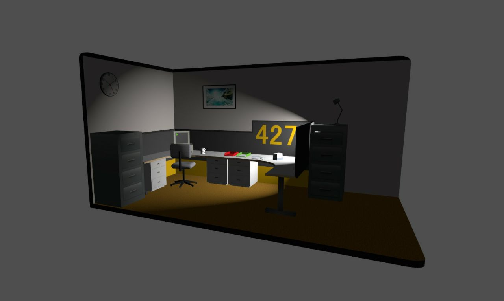

# Vulkan Recreation of "The Stanley Parable" - Computer Graphics Final Project

This project is a small-scale recreation of a portion from "The Stanley Parable" game using Vulkan, showcasing various computer graphics topics such as 3D transformations, shaders, keyboard interactions, and 3D modeling.

## Features

- **3D Transformations**: Explore the world of 3D graphics with advanced transformations, hand made using matrix calculations.
- **Shaders**: Dive into the realm of shaders to create stunning visual effects, like custom coloring or lightining effects.
- **Keyboard Interactions**: Use the keys 'W', 'A', 'S', and 'D' for movement.
- **Mouse Rotation**: Interact with the scene by using the mouse to rotate your view.
- **3D Modeling**: Experience the magic of 3D modeling in computer graphics. All models where custom made using blender.
- **Vulkan**: Harness the power of Vulkan, a low-level graphics API, to create a highly efficient and performant rendering.

## Screenshot

## Compilation

To compile and run this project, you'll need C++, Vulkan, and the GLM library.
